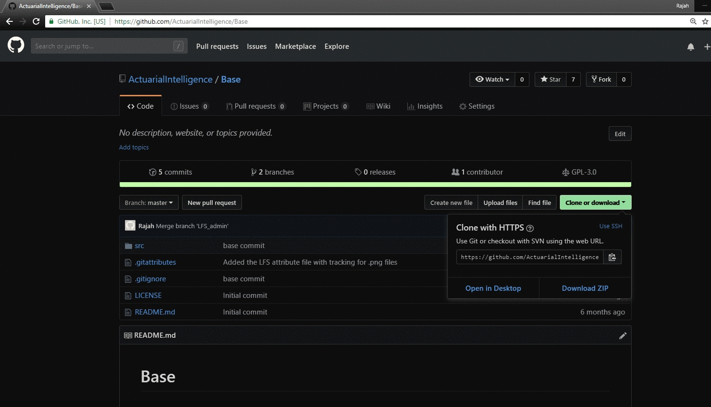

# ActuarialIntelligence Framework 
## For an Efficient Business Layer for Actuarial and AI based Reporting.
### INCLUDED HEREIN ADDITIONAL DEMO : Graphics Engine built up Domain Driven Design Style (We have build this as a challenge to demonstrate the possibility). 

Design has a direct impact on efficiency and scalability of any solution and as such is of great importance. 
Every organization/team has the following concerns when subscribing to a new implementation:
In the short run:
•	Ease of use.
•	How steep is the learning curve
•	Does the solution integrate well with existing systems in our framework
In the long run:
•	How easy will it be for us to change and repurpose the implementation to fit our needs in the future
•	How fast can such changes be implemented
•	How long before we ultimately need to scrap the implementation
•	Can the above be done without affecting productivity or halting operations in any way
The above concerns have been addressed in so many ways over the past twenty years or so, that they have all converged into a handful of global standards in all avenues of design, for instance, software version control is a necessary industry standard, and the evolution of branching strategies help tremendously in the ability to continue changing the nature of the implementation in numerous ways without needing to halt operations. 
Other standards apply to the nature of the changes that are needed and the meetings that surround these.  However, we will concern ourselves more with addressing the bullet points of concern above from a purely architectural standpoint. 
Frameworks and architectures are constantly tested over time and some stand its test, while others fail. The thing that remains a theme in all is the need to make ‘anything and everything’ as organic and easy to manipulate as possible with causing huge ripple effects in the change. The larger the effects of small change, the longer it takes for change to take effect and hence the longer it takes to operate on the new implementation causing delays due to inefficiency.
The convergence discussed above has been such a crucial event, and is the result of the ‘community’ as a whole realizing the need for a sort of ‘well working’ singular standard for doing things. For instance SQL as a language used for querying data is used so widely that it is considered a standard and only incremental modifications to the language are expected. Such is the Language R. 
As such incorporating this language in any implementation will be of significant value to the Actuary and additionally a wise architectural move in any implementation. 
The current infrastructure, specifically what’s both available internally and open-source standard, allows for the following type of architecture without the need for any new tools.
 
The architecture as described above may to convey little and as such we will explain the various components of the architecture.
There are three broad categories:
•	Data 
•	Programmable 
•	Analysis 
The Data layer is simple, these basically store data in the relational tables you design along with the schemas within which these exist. In addition, cube specific data is also stored in this data layer.
The programmable layers enable extremely custom retrieval and persistence of data to your data layer and allow for customization on many levels of the data. Suppose we persist data on a monthly basis to a series of tables. Suppose in addition that we receive cash-flow data and additionally wished to have the Z-spreads stored within a table for later analysis. Then such customization would be possible within this programmable layer. There is no restraint here with regard to the language being used. My personal bias suggests C# is on the rise and stays true to its OOP-ness.
The programmable layer can In addition perform additional calculations on the results of machine learning algorithms. An example of this would be preview of the P.D.F given a ‘shift’ in the data.
Finally the Analytics layer. It is here that one can do a variety of things such as setting up of mining structures and so on. 
II.	Scalability of the Solution
In the diagram you will see a note pointing to the layers that are replaceable. The reason for this being possible is because the architecture ensures loose coupling of the layers. By this we mean that the means by which all the layers are joined overlap in an essentially non-existent fashion with dependencies of the other. 
For this reason one essentially interchange RDBMS’S and causing only the need to change certain connections in the programmable layer and all other logic and so on will not need reprogramming. This is again achieved again within the programming layer itself by: making sure that all the layers joined overlap in an essentially non-existent fashion with dependencies of the other within the solution that is the programming layer. A classic example of this is the relationship between the connection and the reader. The singular job of the connection object is to connect to a file/s or database and retrieve data in its most basic  raw form, the reader then makes use of this data having no knowledge whatsoever of the connection process, i.e. the data-base to which it connects and how this is achieved is irrelevant to the reader. Its job then is to re-structure the data for calculation or simple reporting purposes. 
This loosely coupled design enables us to change the RDBMS at any time with little impact to all that is built upon the programmable layer.
The connection in the following instance is able to connect to arbitrary files and retrieve data.
```C#
namespace Infrastructure.Connections
{
    public class CsvDataConnection<T> : IDataConnection<IList<T>> where T : class
    {
        private readonly FileHelperEngine<T> engine;
        private string path;
        public CsvDataConnection(string path)
        {
            engine = new FileHelperEngine<T>();
            this.path = path;
        }

        public virtual IList<T> LoadData()
        {
            using (var fileStream = new FileStream(path
                , FileMode.Open, FileAccess.Read, FileShare.ReadWrite))
            using (var streamReader = new StreamReader(fileStream))
            {
                return engine.ReadStream(streamReader).ToList();
            }
        }

    }
}
```

The reader is passed the raw data via the connection in a contractual manner, where regardless of what the connection object may be, there is common interface by which the reader/connection communicate and an agreement in the format by which the reader will receive the data. The following reader will receive data in the format: IList<BondsDto>>.
```C#
namespace Infrastructure.Readers
{
    public class BondListReader : IDataReader<IList<BondDetails>>
    {   
        public IDataConnection<IList<BondsDto>> connection;
        public BondListReader(IDataConnection<IList<BondsDto>> connection)
        {
            this.connection = connection;
        }

        public IList<BondDetails> GetData()
        {
            var results =  connection.LoadData();
            var returnType = new List<BondDetails>();
            foreach (var c in results)
            {
                returnType.Add(new BondDetails(c.nominal,c.yearlyCouponRate,c.redemptionRate,c.term,c.inflation));
            }
            return returnType;
        }
    }
}
```
The programmable layer will communicate with any analysis layer via R-Script, as this is a standard, the analysis layer is thus rendered as loosely coupled. This is because the same script can be used across all major analysis tools. 

## III.	Domain Driven Design a glimpse.
Consider a box of LEGO. Everyone knows what each individual block does and the nature by which it is capable of being put together. Advanced LEGO sets have more than one type of block having its own unique function. It is no secret that more than one thing can be built with a singular LEGO set and the domain language in essence is the block. 
 In industry, the domain language is the wording used to describe entities specific to that industry that everyone in the industry understands to mean the same thing. For instance amongst mathematicians, the word vector means an array of numbers contained as an object and these objects have a method by which these are added multiplied and so on. When speaking of a vector thus, there can be no ambiguity with regard to its meaning.  
We want programmable blocks to be as abstract and as re-useable as blocks in a LEGO set so as to be able to manipulate these into a wide variety of applications. In addition to this we want the meaning of the blocks to be so clear that anyone wishing to use them within the context of the domain is clear on what it is, much like the unique LEGO pieces.
Let us look at the above via the use of an example:
IV.	Z-Spread via DDD.
The Z-Spread would be the singular rate, that when added to each of the spot-yields, makes the PV of a set of cash-flows equal to the Nominal or Principle amount.
The re-useable interpolator object makes evaluation of this Z-Spread possible. The interpolator works by means of a Func/delegate. Specifically any function that requires interpolation to any degree of accuracy can be passed in.
Spot Yield object: 
```C#
namespace Domain.ContainerObjects
{
    public class SpotYield
    {
        public Term Term { get; private set; }
        public decimal Yield { get; private set; }
        public SpotYield(decimal yield,Term term)
        {
            Yield = yield;
            Term = term;
        }
    }
}
```

The term CashFlowSet object stores the date, value amount and the spot yield (term : monthly effective in this case), of a cash-flow.
```C#
namespace Domain.ContainerObjects
{
    public class TermCashflowYieldSet : IEquatable<TermCashflowYieldSet>
    {
        public decimal cashflow { get; private set; }
        public decimal term { get; private set; }
        public DateTime date { get; private set; }
        public SpotYield spotYield { get; private set; }

        public TermCashflowYieldSet(decimal cashflow,
                                    decimal term,
                                    DateTime date,
                                    SpotYield spotYield)
        {
            this.cashflow = cashflow;
            this.term = term;
            this.date = date;
            this.spotYield = spotYield;
        }

        public bool Equals(TermCashflowYieldSet other)
        {
            throw new NotImplementedException();
        }
    }
}
```

The following object stores a series of cash-flows.
```C#
namespace Domain.ContainerObjects
{
    public class ListTermCashflowSet
    {
        private IList<TermCashflowYieldSet> cashflowSet;
        private DateTime anchorDate;
        public Term termType { get; private set; }
        public IList<TermCashflowYieldSet> CashflowSet { 
            get 
            { 
                var result = cashflowSet.Where(r=>r.spotYield.Term.Equals(termType)).OrderBy(e => e.date).ToList();
                return result;
            } 
        }
        public DateTime AnchorDate { get { return anchorDate = cashflowSet.First().date; } }
        public ListTermCashflowSet(IList<TermCashflowYieldSet> cashflowSet, Term termType)
        {
            this.cashflowSet = cashflowSet;
            this.termType = termType;
        }

        public void AddCashflows(IList<TermCashflowYieldSet> cashflows)
        {
            cashflowSet.Union(cashflows);
        }

        public decimal DifferenceInUnitsBetweenDates(DateTime dateA, DateTime dateB,int unitScale)
        {
            int remainder =0;
            int days = (dateB - dateA).Days;
            int quotient = Math.DivRem(days, unitScale, out remainder);
            var result = quotient + remainder / unitScale;
            return result;
        }
    }
}
```

The following object makes use of the cash flows, the spot yields and sums an attempt at a Z-Spread value to obtain a PV of the flow. As the accuracy improves, the PV approaches that of the nominal or principle.
```C#
namespace Domain
{
    public class ZSpreadSpecificAnnuity
    {         
        private readonly ListTermCashflowSet cashFlowSet;
        private int days;
        public ZSpreadSpecificAnnuity(ListTermCashflowSet cashFlowSet, int days)
        {
            this.cashFlowSet = cashFlowSet;
            this.days = days;
        }

        public decimal GetPV(decimal zSpread)
        {
            var total = 0m;
            DateTime anchorDate = cashFlowSet.AnchorDate;
            foreach (var cashFlow in cashFlowSet.CashflowSet)
            {
                total += cashFlow.cashflow * discountFactor(cashFlow.spotYield.Yield + zSpread, 
                    cashFlowSet.DifferenceInUnitsBetweenDates(anchorDate, cashFlow.date,days));
            }
            return total;
        }

        private decimal discountFactor(decimal yield, decimal term)
        {
            var d = (1 / (1 + yield));
            var dp = CustomMath.Pow(d,term);
            return dp;
        }
    }
}
```


```C#
namespace Domain
{
    public class ZSpread
    {
        private ListTermCashflowSet cashFlowSet;
        int days;
        private decimal nominal;
        private decimal spread;

        public decimal Spread()
        {
            return spread == 0 ? CalculateZspread() : spread;
        }

        public ZSpread(ListTermCashflowSet cashFlowSet, decimal nominal)
        {
            this.cashFlowSet = cashFlowSet;
            this.nominal = nominal;
            days = cashFlowSet.termType == Term.YearlyEffective ? 365 :
                cashFlowSet.termType == Term.MonthlyEffective ? 30 : 0;
        }

        public decimal CalculateZspread()
        {
            var interpolator = new Interpolation();
            ZSpreadSpecificAnnuity annuity = new ZSpreadSpecificAnnuity(cashFlowSet,days);
            var result = interpolator.Interpolate(annuity.GetPV, 0.01m, 0.09m, nominal);
            spread = result;
            return result; 
        }

    }
}
```

The Z-Spread object makes use of the interpolator to obtain the value of the Z-Spread. You will see that the GetPv() method is passed into the interpolator as a delegate. This method is repeatedly called via the interpolator with every increasingly accurate value of the Z-Spread value interpolated, making abstract the concept of interpolation and not coupling it to the functions it interpolates which in addition makes this interpolation re-useable.
```C#
namespace Domain
{
    public  class Interpolation
    {        
        private decimal i1,i2=0;
        private decimal f = 0;
        private decimal previousValue = 0;

        public decimal Interpolate(Func<decimal,decimal> functional, 
            decimal testValue1,decimal testValue2, decimal interpolationValue)
        {
            decimal tempI = 0;
            i1 = testValue1;
            i2= testValue2;
            f = interpolationValue;
            bool _continue = true; 

            while (_continue)
            {
                tempI = i2;
                previousValue = i2;
                if (functional(i1) == functional(i2)) { break; }
                i2 = nextValue(functional(i1), functional(i2), i1, i2, out _continue);
                i1 = tempI;
                Console.WriteLine(i2);
            }
            return i2;

        }

        private decimal nextValue(decimal f1,decimal f2, 
            decimal i1, decimal i2,out bool _continue)
        {
            _continue = Threshold.Equals((i1 + (i2 - i1) * ((f - f1) / (f2 - f1))),previousValue);
            return (i1 + (i2 - i1) * ((f - f1) / (f2 - f1)));
        }

    }

    public static class Threshold
    {
        private static decimal accuracyThreshold = 0.000000001m;
        public static bool Equals(decimal currentValue, decimal previousValue)
        {          
            bool result = Math.Abs(currentValue - previousValue) < accuracyThreshold ? false : true;
            return result;
        }
    }
}
```

The Threshold tells it when to stop based on the degree of accuracy achieved.


Having built this within an n-layered architecture clarifies and ensures separation of concerns. Simply put, it enforces 
good design and coding principles for all extensions and changes.

Additionally, having built this up in Domain-Driven-Design style, the developer is given the advantage of making use of 
all implementations in an almost LEGO like fashion.   

The Domain layer contains all of the Domain level implementations useful in building up your own Reporting/Intelligence 
solutions. 

These include: 
	Interpolation 
	Bond
	Annuity
	Z-Spread
	Kaplan Meier
	Chapman-Kolmogorov
	Black and Scholes pricing
	
To name just a few, the rest of which can be found within:
	ContainerObjects
	Date
	Enums
	Financial Instrument Objects
	Mathematical Technique Objects
	Matrix
	Model Containers
	NeuralLearners
	NeuralMemmories
	NeuralProcessors
	NeuronParametrix
	ObservationObjects
	PnL
	Properties
	Regression
	Time
	ChapmanKolmogorov
	DBHazardPDF
	Hazard
	KaplanMeier

We have included a sample database mainly as a guideline for mining.
There a variety of experimental implementations that we will branch-out.
In this present state, the solution is capable of 'evolving' based on feedback from mining-structures. 

	

## Getting Started

These instructions will get you a copy of the project up and running on your local machine for development and testing purposes. See deployment for notes on how to deploy the project on a live system.


### Prerequisites

.NET Version 4.6 and compatible Visual Studio.

### Installing

Visit: https://github.com/ActuarialIntelligence/Base/ and clone the repository as follows:


Once complete, go to your local repository(I.e. where the repository was cloned to) and open the ActuarialIntelligence.sln 
file with Visual Studio.

To see a simple demo of the Domain Driven Design Style Graphics Engine built with C#, set the test application as the startup and simply run:   


## Running the tests

All tests can be found within the ActuarialIntelligence.Tests and Threading.Tests projects. 

### Break down into end to end tests

The tests test:
Matrix manipulation and interpolation methods used in evaluating Z-Spreads and Annuity Interest values.
Threading.

The functioning of the DDD-Style Interpolation method, ensures the functioning of all Black and Scholes pricing, 
Bond and Annuity implementations.
 
#### Example:
```C#
namespace ActuarialIntelligence.Tests.Numerical																								.
{
    [TestFixture]
    [Category("Domain")]
    public class InterpolationTests
    {
        List<TermCashflowYieldSet> cashFlowSet;
        [SetUp]
        public void BeforeEachTest()
        {

            cashFlowSet = new List<TermCashflowYieldSet>()
                        {
                            new TermCashflowYieldSet(42000m    ,1m,new DateTime(2016,12,14)  ,new SpotYield(0.0122m,Term.MonthlyEffective)),
                            new TermCashflowYieldSet(42000m    ,2m,new DateTime(2017,1,17)  ,new SpotYield(0.03432m,Term.MonthlyEffective)),
                            new TermCashflowYieldSet(42000m    ,3m,new DateTime(2017,2,14)  ,new SpotYield(0.0252m,Term.MonthlyEffective)),
                            new TermCashflowYieldSet(42000m    ,4, new DateTime(2017,3,21)  ,new SpotYield(0.01332m,Term.MonthlyEffective)),
                            new TermCashflowYieldSet(56783m    ,5 ,new DateTime(2017,4,14)  ,new SpotYield(0.022452m,Term.MonthlyEffective)),
                            new TermCashflowYieldSet(40000m    ,6 ,new DateTime(2017,5,13)  ,new SpotYield(0.02342m,Term.MonthlyEffective)),
                            new TermCashflowYieldSet(2048000m  ,7 ,new DateTime(2017,6,14)  ,new SpotYield(0.012546m,Term.MonthlyEffective))
                        };


        }

        [Test]
        public void AssertInterpolationTest1()
        {
            var flows = new ListTermCashflowSet(cashFlowSet, Term.MonthlyEffective);
            var zSpread = new ZSpread(flows, 2000000m);
            var result = zSpread.Spread();
            var annuity = new ZSpreadSpecificAnnuity(flows, 30);
            var check = annuity.GetPV(0.0132866482605499030537820089M);
            Assert.IsTrue(IsEqualWithinThreshold(result, 0.0132866482605499030537820089M));
            Assert.IsTrue(IsEqualWithinThreshold(check, 2000000m));
        }

        private bool IsEqualWithinThreshold(decimal a, decimal b)
        {
            if (a - b > 0.0001m || a - b <= 0.0001m)
            {
                return true;
            }
            else { return false; }
        }
    }
}
```

## Built With

Visual Studio 2017 Community Edition.

## Evolution Development Sample


## Versioning

We use Git/GitExtensions combination for versioning.

## Authors

Rajah Iyer, Jyothiniranjan Pillay
https://www.researchgate.net/profile/Rajah_Iyer
https://www.linkedin.com/in/rajah-iyer-628689168/


## License

This project is licensed under the MIT License - see the [LICENSE.md](LICENSE.md) file for details

## Acknowledgments

HAL
Research Gate

None of the code was obtained from external sources, i.e. the code was written by the author.

# Disclaimer

We have provided test coverage as best as we can and as such we will not be held responsible for any and all losses or damages that may asise from the usage of this software.

